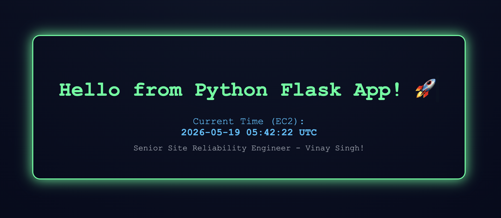

# Infrastructure as Code (IaC) with Terraform: Python Web App on AWS 🚀

[](https://github.com/vinay-singh-engineer/terraform-aws-stack/blob/main/LICENSE)


This project uses **Terraform** to provision AWS infrastructure that runs a Python Flask web application behind an nginx reverse proxy.

---

## 🧭 Architecture

### Flow

```
Terraform
  ↓
Custom VPC
  ↓
Public Subnet
  ↓
Internet Gateway
  ↓
Route Table
  ↓
Security Group (HTTP open, SSH restricted to your IP)
  ↓
EC2 (t3.micro, encrypted EBS, IMDSv2 enforced)
  ↓
nginx (port 80) → Gunicorn (port 8000) → Flask App
  ↓
Public IP → Browser
```

---

## ⚙️ Prerequisites

Before running this project, install and configure the following tools.

---

### 1. Install Terraform (>= 1.5.0)

Download and install Terraform from: https://developer.hashicorp.com/terraform/downloads

Verify installation: `terraform -v`

### 2. Install AWS CLI

Download and install AWS CLI from https://aws.amazon.com/cli/

Verify installation: `aws --version`

### 3. Configure AWS credentials

Run: `aws configure`

Enter:

- AWS Access Key ID
- AWS Secret Access Key
- Default region: us-east-1
- Output format: json

---

## 📁 Project Structure

```
iac-python-webapp/
├── main.tf               # All AWS resources
├── variables.tf          # Input variable declarations
├── outputs.tf            # Output declarations (public IP, app URL)
├── user_data.sh          # EC2 bootstrap script (installs nginx, gunicorn, Flask)
├── terraform.tfvars      # Your variable values (gitignored — you create this)
├── .terraform.lock.hcl   # Provider version lock file
├── .gitignore            # Excludes state files, provider binaries, tfvars
└── README.md
```

---

## 🚀 How to Run

**Step 1:** Initialize Terraform

```
terraform init
```

**Step 2:** Create `terraform.tfvars` with your IP to restrict SSH access

```
ssh_allowed_cidr = "YOUR.IP.HERE/32"
```

Get your IP with: `curl -4 ifconfig.me/ip`

**Step 3:** Validate configuration

```
terraform validate
```

**Step 4:** Preview execution plan

```
terraform plan
```

**Step 5:** Apply infrastructure

```
terraform apply
```

---

## 🌍 Access the Application

After a successful deploy, Terraform outputs:

```
app_url = "http://<public-ip>"
public_ip = "<public-ip>"
```

**Wait 3–5 minutes** before opening the URL — `user_data.sh` runs on first boot and installs all dependencies before starting the app.

Poll until ready:

```bash
while true; do curl -s -o /dev/null -w "%{http_code}\n" http://<public-ip>; sleep 5; done
```

Wait for `200`, then open the URL in your browser. You should see:



---

## 🧹 Destroy Infrastructure

To avoid AWS charges, always destroy resources when not needed:

```
terraform destroy
```

---

## 🧠 What This Project Demonstrates

This project shows practical understanding of:

- **Infrastructure as Code (Terraform)**
  - Provisioned AWS infrastructure using Terraform
  - Defined repeatable and version-controlled infrastructure setup
  - Externalized configuration (region, instance type, AZ, SSH CIDR) in `variables.tf`
  - Exposed key deployment details via `outputs.tf`
  - Pinned Terraform CLI version with `required_version`
  - Locked provider versions with `.terraform.lock.hcl`

- **AWS EC2 provisioning**
  - Launched Amazon Linux 2 EC2 instances using dynamic AMI lookup
  - Upgraded to `t3.micro` (current-generation, better performance than t2)
  - Enforced IMDSv2 (`http_tokens = required`) to prevent SSRF-based credential theft
  - Enabled EBS root volume encryption at rest

- **Security hardening**
  - Restricted SSH access to a single IP via `ssh_allowed_cidr` variable (not open to the internet)
  - Enforced IMDSv2 on the instance metadata service
  - Encrypted EBS root volume
  - Protected state files and secrets with `.gitignore`

- **Security Groups and networking**
  - Configured inbound rules for HTTP (80) and SSH (22, IP-restricted)
  - Implemented VPC-based networking with custom subnets
  - Set up Internet Gateway and route tables for public access
  - Parameterized availability zone for portability

- **Production-grade application serving**
  - Replaced Flask development server with **Gunicorn** WSGI server
  - Used **nginx** as a reverse proxy (port 80 → Gunicorn on 8000)
  - Managed app lifecycle with a **systemd service** (auto-restart on crash, starts on reboot)
  - Pinned Flask and Gunicorn versions for reproducible deployments

- **Automated server bootstrapping using user_data**
  - Automated full stack installation at launch (nginx, Python, Flask, Gunicorn)
  - Used quoted heredocs (`<<'EOF'`) to safely embed Python and HTML without shell expansion
  - Enabled `set -xe` logging to `/var/log/user_data.log` for bootstrap debugging

- **Deploying a working web application in the cloud (AWS)**
  - Hosted a Flask web application on AWS EC2
  - Served dynamic HTML displaying real-time UTC timestamp over a public endpoint

---

## 📌 Notes

- `terraform.tfvars` is gitignored — you must create it locally before running `terraform apply`
- The app takes 3–5 minutes to become available after `terraform apply` completes
- This project is intended for learning and demonstration purposes
- Always run `terraform destroy` to avoid unnecessary AWS costs

---

## CI

Two checks run on every push to `main` or `development`, and on pull requests targeting `main`:

| Job | Tool | What it checks |
| :--- | :--- | :--- |
| Terraform format | `terraform fmt -check` | All `.tf` files are correctly formatted |
| Terraform validate | `terraform validate` | Configuration is syntactically valid |

---

## License

MIT — use freely, attribute appreciated.

---

## 💻 Author

[Vinay Singh](https://vinay-singh-engineer.github.io)

---